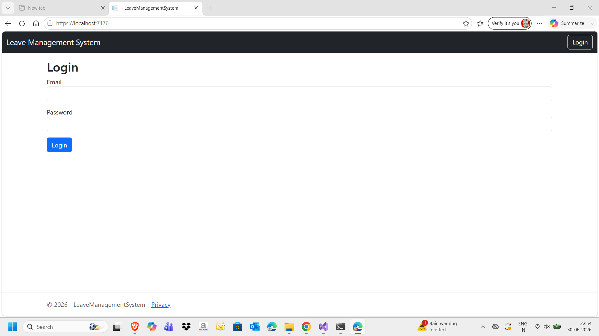
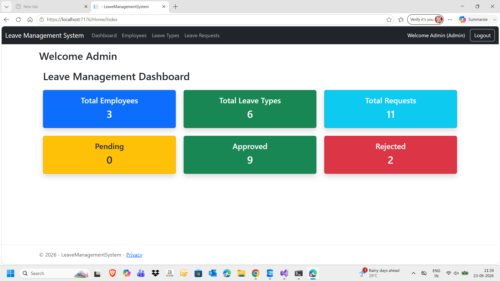
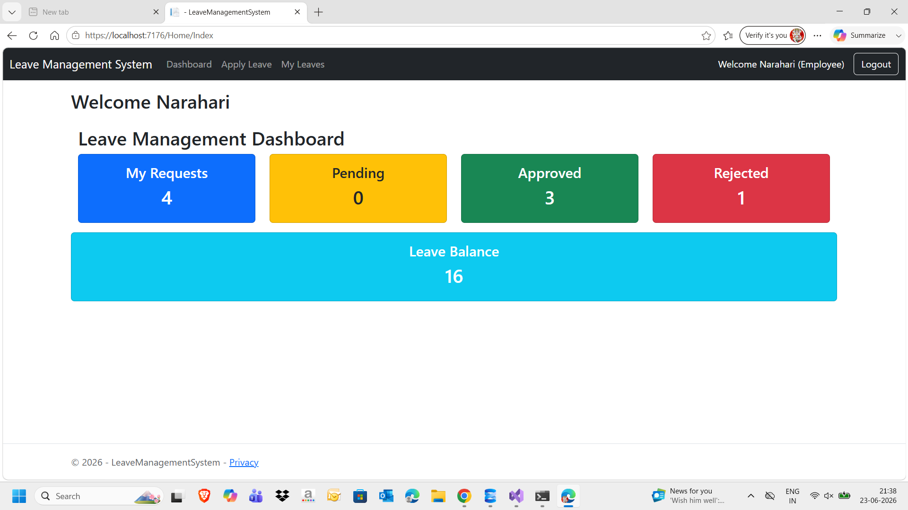
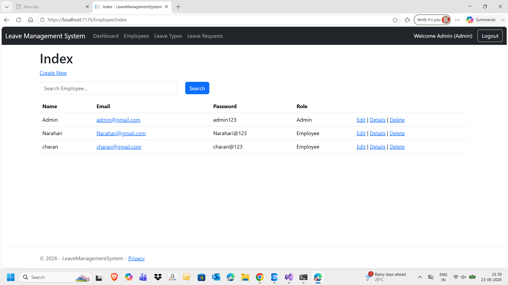
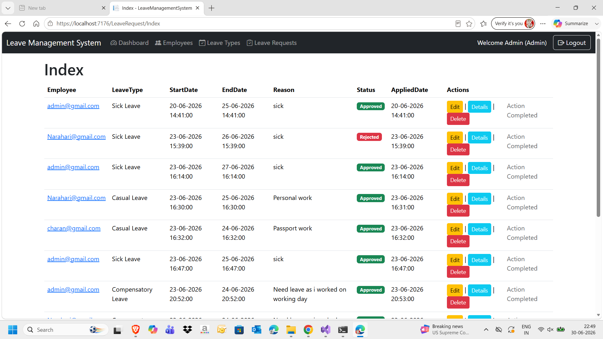

# Leave Management System

A professional Leave Management System developed using ASP.NET Core MVC, Entity Framework Core, SQL Server, and Bootstrap.

---

## Features

### Admin
- Secure Login
- Employee Management
- Leave Type Management
- Approve/Reject Leave Requests
- Dashboard

### Employee
- Secure Login
- Apply Leave
- View Leave Status
- Leave Balance Tracking

---

## Technologies Used

- ASP.NET Core MVC (.NET 8)
- C#
- Entity Framework Core
- SQL Server
- Bootstrap 5
- HTML5
- CSS3
- JavaScript
- Razor Views

---

## Project Structure

```
Controllers
Models
Views
Data
ViewModels
wwwroot
```

---

## Screenshots

### Login



---

### Admin Dashboard



---

### Employee Dashboard



---

### Employee Management



---

### Leave Requests



---

## Installation

1. Clone the repository

```
git clone https://github.com/YOUR_USERNAME/LeaveManagementSystem.git
```

2. Open in Visual Studio

3. Restore NuGet Packages

4. Update Connection String

5. Run Database Migrations

6. Run the Project

---

## Future Enhancements

- Email Notifications
- JWT Authentication
- Role-based Authorization
- Reports
- Leave Calendar
- File Upload
- REST API Integration

---

## Author

Narahari Vinjam
